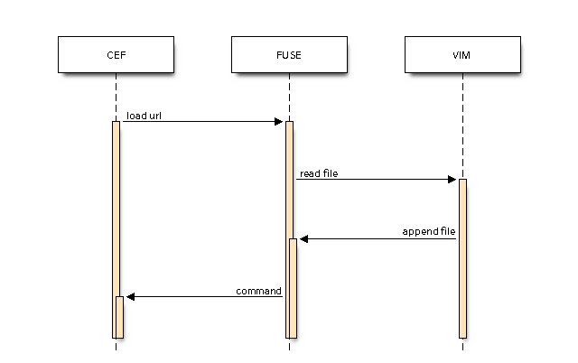

<h1>Status of project: POC</h1>

# Goal

problems:

- vim user, I often need to go to the web, which forces me to leave the environment to go to the browser.

- many programs partially integrate vim's navigation, but this is only an imperfect adaptation.

I would therefore like to answer these 2 problems.

# How

The idea is to make a gateway between the website and vim with [Fuse](https://github.com/libfuse/libfuse).



`
CEF = headless browser
FUSE = file system user space
VIM = editor
`

The [Chromium Embedded Framework](https://bitbucket.org/chromiumembedded/cef/) (CEF) is a simple framework for embedding Chromium-based browsers in other applications. This repository hosts a sample project called "cef-project" that can be used as the starting point for third-party applications built using CEF.


```
 _____  ___________          ______ _   _ _____ _____            _    _ ___________  _____ ______ _____ _      _____ 
/  __ \|  ___|  ___|    _    |  ___| | | /  ___|  ___|  ______  | |  | |  ___| ___ \/ __  \|  ___|_   _| |    |  ___|
| /  \/| |__ | |_     _| |_  | |_  | | | \ `--.| |__   |______| | |  | | |__ | |_/ /`' / /'| |_    | | | |    | |__  
| |    |  __||  _|   |_   _| |  _| | | | |`--. \  __|   ______  | |/\| |  __|| ___ \  / /  |  _|   | | | |    |  __| 
| \__/\| |___| |       |_|   | |   | |_| /\__/ / |___  |______| \  /\  / |___| |_/ /./ /___| |    _| |_| |____| |___ 
 \____/\____/\_|             \_|    \___/\____/\____/            \/  \/\____/\____/ \_____/\_|    \___/\_____/\____/ 
```                                                                                                                    

# Next Steps

- Ask for help
- Improve this README
- Improve POC coding
- Extract with js div's text
- Add command control (quit, append text, move cursor, click ...)
- Cut web page on multiple files (?)
- Add javascript plugins to modify the view of the pages according to the url
- Add image to explain previous idea 
- ...

# Support and Contributions

If you have any questions about CEF or cef-project [CEF Forum](http://www.magpcss.org/ceforum/).

If you would like to make contributions [](https://liberapay.com/~1772507/donate) or participate in the project.
